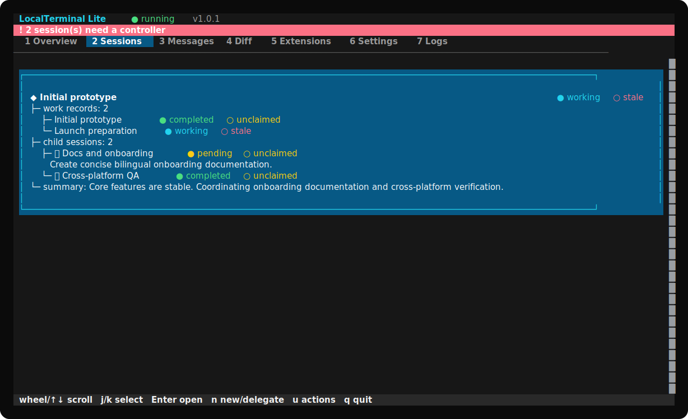
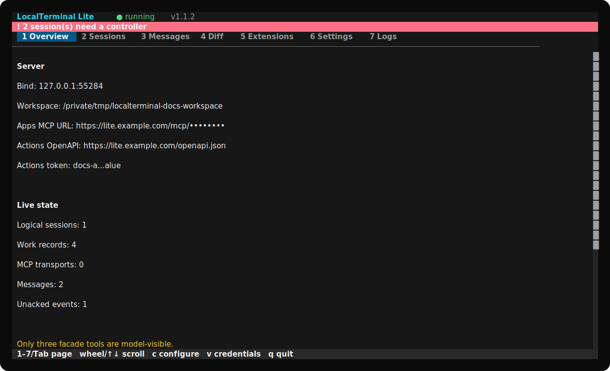

# LocalTerminal Lite

[中文](README.zh-CN.md) · [Actions tutorial](docs/ACTIONS_SETUP.md) · [GPT instructions](docs/GPT_INSTRUCTIONS.md) · [Prompt playbook](docs/PROMPT_PLAYBOOK.md) · [Privacy](docs/PRIVACY.md)

LocalTerminal Lite 1.0.0 connects one local project to ChatGPT through an auditable, inheritable work-session layer. It supports ChatGPT **Actions** and **Apps (MCP)**, multi-session collaboration, durable messages, declarative extensions, Git-style live diff tracking, and a full-window bilingual OpenTUI interface.



## Start with one command

You do not need Git, Node.js, Bun, or another programming environment beforehand. The installers fetch Bun, download the fixed `v1.0.0` source archive, install locked dependencies, and start the TUI.

### macOS

```bash
/bin/bash -c "$(curl -fsSL https://raw.githubusercontent.com/wyj-IIRtyj/localterminal-lite/v1.0.0/scripts/install-macos.sh)"
```

### Windows PowerShell

```powershell
powershell -NoProfile -ExecutionPolicy Bypass -Command "irm https://raw.githubusercontent.com/wyj-IIRtyj/localterminal-lite/v1.0.0/scripts/install-windows.ps1 | iex"
```

Remote scripts are convenient but security-sensitive. You can inspect [install-macos.sh](scripts/install-macos.sh) or [install-windows.ps1](scripts/install-windows.ps1) before running them.

The first-run TUI configures everything: language, theme, authorized workspace, bind address, public URL, limits, Apps connector key, and Actions token. No `.env` or manual configuration-file editing is required.

Already have Bun 1.3 or newer?

```bash
git clone https://github.com/wyj-IIRtyj/localterminal-lite.git
cd localterminal-lite
bun install --frozen-lockfile
bun run dev
```

## Choose a connection

| Connection | Use it when | Endpoint shown by Lite |
| --- | --- | --- |
| GPT Actions | You are building a custom GPT with an OpenAPI Action. | `https://YOUR-HOST/openapi.json` |
| ChatGPT Apps | Your eligible workspace supports custom MCP apps/connectors. | `https://YOUR-HOST/mcp/<hidden-connector-key>` |

A GPT can use Apps or Actions, not both at once. For Actions, follow the complete privacy-safe [English tutorial](docs/ACTIONS_SETUP.md) or [Chinese tutorial](docs/ACTIONS_SETUP.zh-CN.md). It covers HTTPS tunneling, schema import, Bearer authentication, GPT setup, Preview testing, and common error messages.

## Why three facade tools

The model sees exactly three operations:

- `extension_discover`: learn identity, concrete tools, schemas, and extension registration;
- `extension_call`: invoke a concrete workspace, Git, session, message, or custom tool;
- `extension_register`: validate, upsert, or remove a declarative extension.

The small surface keeps configuration stable while concrete capabilities remain discoverable. In Actions, operation IDs use camelCase (`extensionDiscover`, `extensionCall`, `extensionRegister`) but preserve the same meanings.

```text
ChatGPT
  └─ extensionCall
       ├─ tool: session_register
       ├─ input: { mode: "root", name: "main" }
       └─ identity: { sessionId, sessionToken }  # after bootstrap
```

Use the supplied [GPT instructions](docs/GPT_INSTRUCTIONS.md) to prevent schema-layer mistakes, and give users the [short prompt playbook](docs/PROMPT_PLAYBOOK.md) instead of long prompts.

## Auditable collaboration

A Lite session is a work context, not a ChatGPT conversation ID.

- New work creates and claims a root with `session_register(mode=root)`.
- Delegation creates multiple direct child sessions with structured task packages; children cannot create grandchildren.
- `session_inherit` claims pending, stale, released, or revoked unfinished work with a one-time claim code.
- Completed work is immutable. Continue it with a same-level `session_register(...continuesSessionId)`, never with `session_inherit`.
- Every work turn ends with a structured `session_checkpoint`.
- Messages are durable, sender identity cannot be forged, and event delivery repeats until explicitly acknowledged.
- Permanent JSONL history stores task packages, checkpoints, messages, state events, and sanitized tool audits.

## TUI owner control plane

The seven full-window pages are Overview, Sessions, Messages, Diff, Extensions, Settings, and Logs.



- Mouse wheel and keyboard scrolling use native OpenTUI ScrollBox viewports.
- Drag selection is renderer-owned and copies through OSC 52 plus the host clipboard.
- Continuations remain inside one logical session card; delegated children appear as indented directory-style nodes with phase and presence colors.
- Enter opens complete session history or a two-way message conversation.
- Diff shows staged, unstaged, and untracked workspace changes.
- Logs can include sanitized factual tool calls from every session.
- All settings and credential rotation stay inside the TUI.

Input is routed in one order: modal → focused form control → current page → global shortcuts. OpenTUI owns alternate-screen lifecycle, mouse decoding, layout, wrapping, incremental drawing, and terminal restoration.

## Security and privacy

Lite is local-first and has no project telemetry. The selected workspace is a real read/write security boundary: use a dedicated project, review Diff and Logs, keep credentials masked, and stop public tunnels when not needed.

- Connection credentials live in the operating-system user configuration directory.
- Only session-token hashes are persisted.
- Identity, authorization, claim-code, message-body, and content fields are redacted from audit argument snapshots.
- Only the TUI owner can permanently delete sessions and history.

Read the [privacy notice and deployment template](docs/PRIVACY.md). Public GPTs with Actions need a privacy policy that accurately covers the publisher's own endpoint and data flow.

Report vulnerabilities through the private process in [SECURITY.md](SECURITY.md), never through a public issue containing credentials or private source.

## Documentation map

| Document | English | 中文 |
| --- | --- | --- |
| Full GPT Actions setup | [Open](docs/ACTIONS_SETUP.md) | [打开](docs/ACTIONS_SETUP.zh-CN.md) |
| Recommended GPT preset instructions | [Open](docs/GPT_INSTRUCTIONS.md) | [打开](docs/GPT_INSTRUCTIONS.zh-CN.md) |
| Short scenario prompts | [Open](docs/PROMPT_PLAYBOOK.md) | [打开](docs/PROMPT_PLAYBOOK.zh-CN.md) |
| Privacy and deployment template | [Open](docs/PRIVACY.md) | [打开](docs/PRIVACY.zh-CN.md) |

## Development and verification

Requirements: Bun 1.3 or newer.

```bash
bun install --frozen-lockfile
bun run typecheck
bun run test
bun run dev
```

The test suite covers OpenAPI 3.1, Actions and Apps identity, controller takeover, fixed checkpoint timing, parent/child completion, event ACK, subscriptions, durable history, redaction, migration, deletion, continuation, OpenTUI wheel scrolling, and drag selection.

Headless mode is available only after first-run TUI setup:

```bash
bun run build
bun run start -- --headless
```

## License

Licensed under the [Apache License 2.0](LICENSE), which permits personal and commercial use, modification, and redistribution and includes an explicit patent grant. Third-party packages retain their own licenses.

LocalTerminal Lite is an independent open-source project and is not affiliated with or endorsed by OpenAI or Cloudflare. ChatGPT, OpenAI, and Cloudflare names are used only to describe interoperability.
