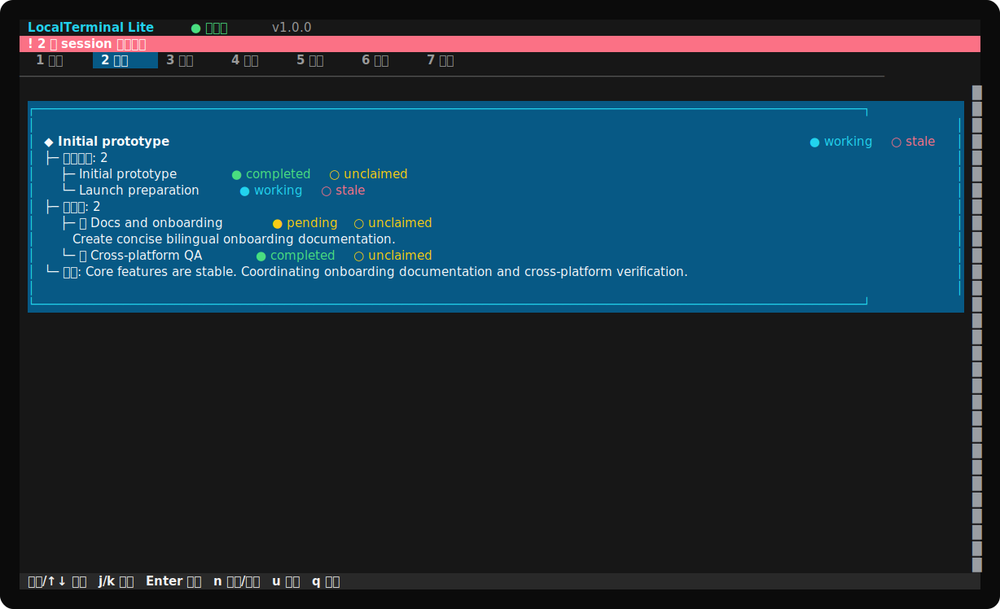
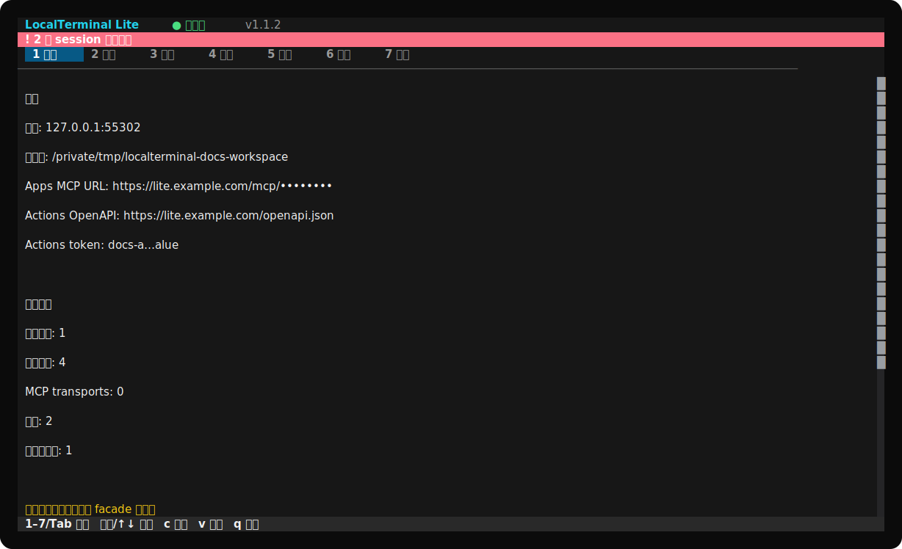

# LocalTerminal Lite

[English](README.md) · [Actions 教程](docs/ACTIONS_SETUP.zh-CN.md) · [GPT 预设指令](docs/GPT_INSTRUCTIONS.zh-CN.md) · [短提示词手册](docs/PROMPT_PLAYBOOK.zh-CN.md) · [隐私说明](docs/PRIVACY.zh-CN.md)

LocalTerminal Lite 的核心目的，是让 **ChatGPT 的普通 Chat 对话模式也能以可控方式在本地电脑上工作**。通过为自定义 GPT 配置 Action，或接入 ChatGPT App，普通 ChatGPT 对话就可以查看和编辑获准的本地项目、运行受约束的工具、协调多个工作 session 并汇报进展；用户始终通过本地 TUI 保留控制权。Lite 是 ChatGPT Chat 与本地电脑之间的桥梁，不是另一个聊天客户端。

LocalTerminal Lite 1.1.1 通过可审计、可继承的工作 session 层提供这座桥梁。它同时支持 ChatGPT **Actions** 和 **Apps（MCP）**，并提供多 session 协作、永久消息、声明式扩展、Git 风格实时 diff，以及覆盖整个终端窗口的中英双语 OpenTUI 界面。



## 安装与启动

### 第一次安装

无需提前安装 Git、Node.js、Bun 或其他编程环境。安装脚本会下载与当前平台和 CPU 架构匹配的 `v1.1.1` 独立可执行文件，校验 SHA-256，把 `localterminal-lite` 注册成当前用户的全局命令，然后启动 TUI。发行安装不再下载臃肿的源码包或安装运行时依赖。

#### macOS

```bash
/bin/bash -c "$(curl -fsSL https://raw.githubusercontent.com/wyj-IIRtyj/localterminal-lite/v1.1.1/scripts/install-macos.sh)"
```

#### Linux

```bash
/bin/bash -c "$(curl -fsSL https://raw.githubusercontent.com/wyj-IIRtyj/localterminal-lite/v1.1.1/scripts/install-linux.sh)"
```

#### Windows PowerShell

```powershell
powershell -NoProfile -ExecutionPolicy Bypass -Command "irm https://raw.githubusercontent.com/wyj-IIRtyj/localterminal-lite/v1.1.1/scripts/install-windows.ps1 | iex"
```

直接运行远端脚本很方便，但也需要谨慎。执行前可以先检查 [macOS 安装脚本](scripts/install-macos.sh)、[Linux 安装脚本](scripts/install-linux.sh)或 [Windows 安装脚本](scripts/install-windows.ps1)。

首次启动的 TUI 会完成全部配置：语言、主题、授权工作区、监听地址、公网 URL、限制、Apps connector key 和 Actions token。不需要 `.env`，也不需要手动修改配置文件。

### 第二次及以后快速启动

重新打开一个终端、PowerShell 或命令提示符窗口，直接输入安装器为当前用户注册的全局命令。启动器通过版本化 `releases/<版本>` 目录和原子的 `current` 指针定位当前二进制。已经安装 GitHub `v1.0.1`、开发过程中的中间源码版本或旧二进制版本的用户，直接再次运行上面的 `v1.1.1` 命令即可无损迁移；用户配置、凭据、workspace、session、消息和历史不会被删除。

```text
localterminal-lite
```

Lite 会继续使用此前通过 TUI 保存的配置。如果 ChatGPT 通过临时 Quick Tunnel 接入，还需要单独重新启动隧道；它的随机公网 URL 可能发生变化。

### 从源码安装

如果已经安装 Bun 1.3 或以上版本：

```bash
git clone https://github.com/wyj-IIRtyj/localterminal-lite.git
cd localterminal-lite
bun install --frozen-lockfile
bun run dev
```

## 选择连接方式

| 连接 | 适用场景 | Lite 显示的 endpoint |
| --- | --- | --- |
| GPT Actions | 为自定义 GPT 配置 OpenAPI Action。 | `https://你的域名/openapi.json` |
| ChatGPT Apps | 符合条件的工作区支持自定义 MCP app/connector。 | `https://你的域名/mcp/<隐藏的-connector-key>` |

一个 GPT 不能同时使用 Apps 和 Actions。Actions 用户请阅读隐私安全的[中文完整教程](docs/ACTIONS_SETUP.zh-CN.md)或[英文教程](docs/ACTIONS_SETUP.md)，其中包括 HTTPS 隧道、schema 导入、Bearer 认证、GPT 配置、预览测试和常见报错。

## 为什么只有三个 facade 工具

模型始终只看到三个操作：

- `extension_discover`：了解身份、具体工具、schema 和扩展注册方式；
- `extension_call`：调用工作区、Git、session、消息或自定义具体工具；
- `extension_register`：验证、upsert 或移除声明式扩展。

稳定的小接口避免 GPT 配置随工具增加而膨胀，具体能力仍可按需发现。Actions 中 operation ID 使用 camelCase（`extensionDiscover`、`extensionCall`、`extensionRegister`），语义相同。

```text
ChatGPT
  └─ extensionCall
       ├─ tool: session_register
       ├─ input: { mode: "root", name: "main" }
       └─ identity: { sessionId, sessionToken }  # bootstrap 后
```

使用项目提供的 [GPT 预设指令](docs/GPT_INSTRUCTIONS.zh-CN.md)避免 API 分层错误；向普通用户提供[短提示词手册](docs/PROMPT_PLAYBOOK.zh-CN.md)，不需要长篇提示词。

## 可审计协作

Lite session 是工作上下文，不是 ChatGPT 对话 ID。

- 新任务通过 `session_register(mode=root)` 创建并领取 root。
- Root 可以用结构化任务包创建多个直接子 session；子 session 不得创建孙 session。任务应按领域、专家能力和可并行工作量拆分，不能把一个大型目标整体交给单个子 session。
- 协作是主动的：在范围内且不会产生冲突时，session 可以直接帮助其他 session 完成部分工作，并通过永久消息交接可纳入成果。
- `session_inherit` 使用一次性 claim code 领取 handoff/released/revoked 的未完成工作；同一 ChatGPT 对话因中断变 stale 时，可用之前的 sessionToken 重新领取原 session。
- Completed 工作不可变。续作必须创建同级 `session_register(...continuesSessionId)`，不能调用 `session_inherit`。
- session 状态更新优先级最高。每轮工作的最后一个 LocalTerminal 调用必须是带准确 phase 的结构化 `session_checkpoint`。
- Root 只有在所有直属子 session 终态、且所有子消息和事件都已审阅后才能完成。被阻止的完成请求会返回子 session 时间戳、最后活动、最近操作、消息时序和 `mustContinue` 指引。
- 消息永久保存。AI 消息保留当前认证 session 身份；TUI 用户手动发送的消息明确标记为 `user`。读取消息时会返回发送/观察时间、消息年龄、发送后的审计操作和延迟/滞后提示。
- 追加式 JSONL 历史记录任务包、checkpoint、消息、状态事件和脱敏工具审计。

## TUI 用户控制面板

七个全屏页面分别是：概览、会话、消息、差异、扩展、设置和日志。



- 鼠标滚轮和键盘滚动由 OpenTUI 原生 ScrollBox viewport 处理。
- 拖动框选由 renderer 管理，通过 OSC 52 和系统剪贴板复制。
- Continuation 保留在一个逻辑 session 卡片内；委派子项像目录一样缩进，并保留 phase/presence 颜色。
- Enter 可打开完整 session 历史或双向消息对话。
- Diff 展示 staged、unstaged 和 untracked 工作区变化。
- Logs 可以显示所有 session 的脱敏事实工具调用。
- 所有设置和凭据轮换都在 TUI 内完成。有限选项使用键盘/鼠标选择器；自由文本在首次输入时替换预填值，并支持 `Ctrl+U` 一键清空。按住 `V` 显示凭证，松开后自动隐藏。

输入优先级固定为：模态框 → 当前表单控件 → 当前页面 → 全局快捷键。OpenTUI 负责 alternate screen 生命周期、鼠标解析、布局、换行、增量绘制和终端恢复。

## 安全与隐私

Lite 以本地运行为主，没有项目遥测。所选工作区是真实的读写安全边界：请使用专用项目，检查 Diff 和 Logs，保持凭据隐藏，并在不需要公网访问时停止隧道。

- 连接凭据保存在操作系统用户配置目录；
- 只持久化 session token 的哈希；
- 审计参数会清除 identity、authorization、claim code、消息正文和 content；
- 只有 TUI 用户能够永久删除 session 与历史。

请阅读[隐私说明与部署模板](docs/PRIVACY.zh-CN.md)。发布带 Actions 的公开 GPT 时，隐私政策必须准确覆盖发布者自己的 endpoint 和数据流。

漏洞请按照 [SECURITY.md](SECURITY.md) 的私密流程报告，不要在包含凭据或私有源码的公开 Issue 中提交。

## 文档地图

| 文档 | 中文 | English |
| --- | --- | --- |
| GPT Actions 完整配置 | [打开](docs/ACTIONS_SETUP.zh-CN.md) | [Open](docs/ACTIONS_SETUP.md) |
| 推荐 GPT 预设指令 | [打开](docs/GPT_INSTRUCTIONS.zh-CN.md) | [Open](docs/GPT_INSTRUCTIONS.md) |
| 特定场景短提示词 | [打开](docs/PROMPT_PLAYBOOK.zh-CN.md) | [Open](docs/PROMPT_PLAYBOOK.md) |
| 隐私与部署模板 | [打开](docs/PRIVACY.zh-CN.md) | [Open](docs/PRIVACY.md) |

## 开发与验证

要求 Bun 1.3 或以上版本。

```bash
bun install --frozen-lockfile
bun run typecheck
bun run test
bun run dev
```

测试覆盖 OpenAPI 3.1、Actions/Apps 身份、控制权接管、固定 checkpoint 计时、父子完成审计、事件 ACK、订阅、永久历史、脱敏、迁移、删除、continuation、OpenTUI 滚轮和拖动框选。

首次 TUI 配置完成后，可以无界面运行：

```bash
bun run build
bun run start -- --headless
```

## 开源协议

项目使用 [Apache License 2.0](LICENSE)，允许个人和商业使用、修改及再分发，并提供明确的专利授权。第三方依赖保留各自协议。

LocalTerminal Lite 是独立开源项目，与 OpenAI 或 Cloudflare 没有关联，也未获得其背书。ChatGPT、OpenAI 和 Cloudflare 名称仅用于说明互操作性。
## 更新

LocalTerminal Lite 会在 TUI 启动时检查 GitHub 最新发行版。设置页会显示当前版本和最新版本；有新版本时按 `U` 可一键安装。更新器下载当前平台的预编译二进制与 SHA-256，安装到新的版本目录，再原子切换 `current` 指针；失败时保留原版本并自动回滚。Git 源码工作区不会被一键更新覆盖。完整迁移和后续更新说明见 [v1.1.1 发布说明](RELEASE_NOTES.md)。

工作区状态迁移采用可重复执行的增量合并：现有目标状态、旧全局状态、`state.migrated` 和工作区 `.localterminal-lite` 会按稳定 ID 合并，session 历史文件会去重并完整保留。
## 共享端口与工作区路由

多个 LocalTerminal Lite 进程可以在 Apps connector key 和 Actions token 相同的前提下共用同一个 `host:port`。每个进程仍保留独立的 workspace、状态、session、历史和日志。端口组会选出一个公共网络 leader，其余成员仅监听本机回环端口；leader 退出后，其他成员会自动接管公共端口。

在共享端口下，`extension_discover` 会列出当前活动的 workspace ID。新建 root session 时必须在 `session_register` 的 input 中传入 `workspaceId`；后续请求按 Lite session identity 路由，Apps 也可继续使用已验证的 `openai/session` 绑定。同一个 workspace 不允许被两个进程同时运行。若端口由非 LocalTerminal 程序占用，仍进入 kill、换端口或取消的处理流程。不同端口形成相互独立的端口组，聚合日志也不会跨端口混合。
### macOS 被动锁屏保护

设置页提供仅限 macOS 的被动锁屏控制，支持 `arm`、`standby` 和 `off` 三种操作。选择 `arm` 后，程序会保持显示器唤醒、显示全屏保护遮罩，并在首次键盘或鼠标输入时发送系统 `Control–Command–Q` 锁屏快捷键。锁屏后 helper 不退出，而是进入 `standby`：释放防睡眠断言和输入监听，用户可以正常使用电脑；之后可再次选择 `arm`，或选择 `off` 彻底关闭 helper。只有当最后一个 LocalTerminal Lite 进程退出时才会终止全局 helper；关闭任意单个 workspace runtime 不会影响仍在运行的其他进程。

该功能目前仅支持 macOS。它需要为启动 LocalTerminal Lite 的终端或宿主进程（例如 Terminal、iTerm2）授予“无障碍”权限；部分 macOS 版本也可能显示 `LocalTerminal Lite Passive Lock`。权限窗口和设置页会明确说明所需权限及授权对象。

### 集群更新

安装更新不会终止正在运行的 TUI 进程。现有 Apps/Actions 流量会继续由内存中的旧代码处理，workspace 状态仍保存在磁盘。请逐个重启成员以切换到已安装版本，并最后重启当前网络 leader，以减少端口接管时的短暂中断。不同应用版本只有在集群协议版本相同时才允许共存；协议不兼容会在加入前被拒绝，避免混合版本破坏状态或路由。占用端口的旧版非集群 LocalTerminal Lite 会被视为普通端口冲突，不能直接加入；测试时应使用其他端口，或先把旧进程重启到支持集群的版本。
