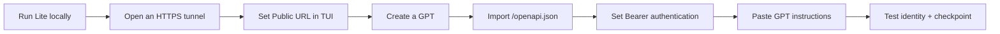
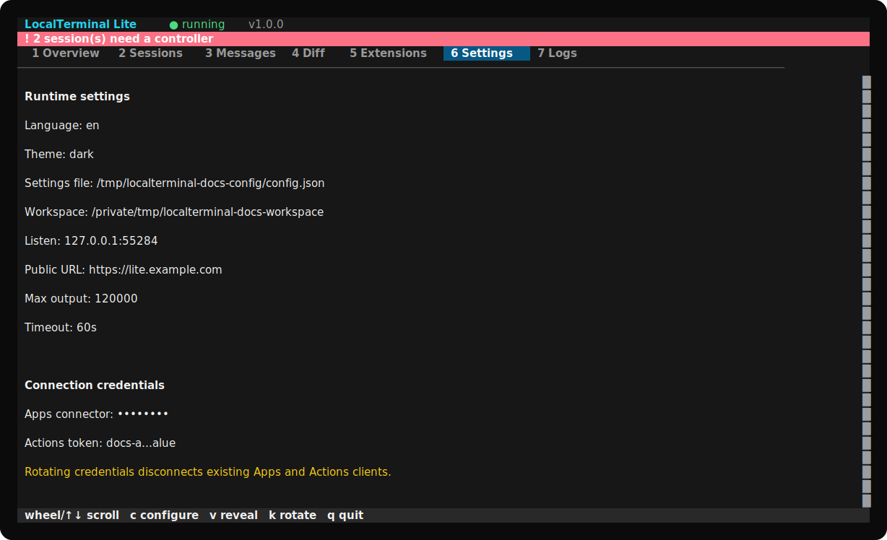
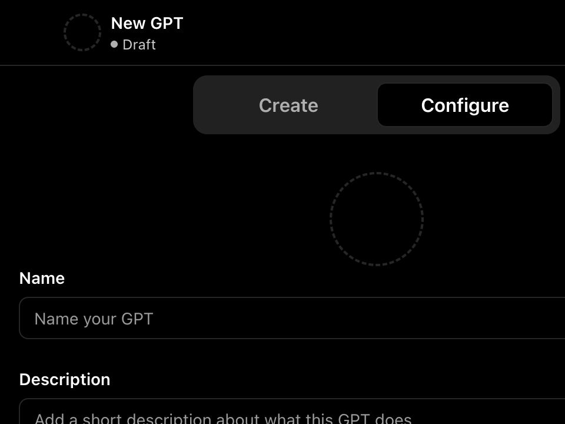
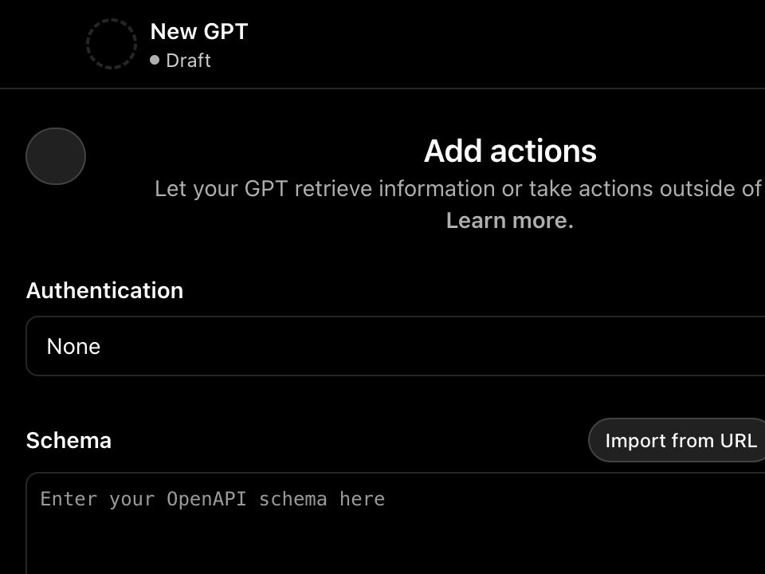
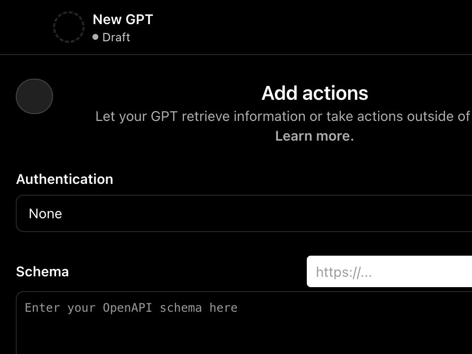
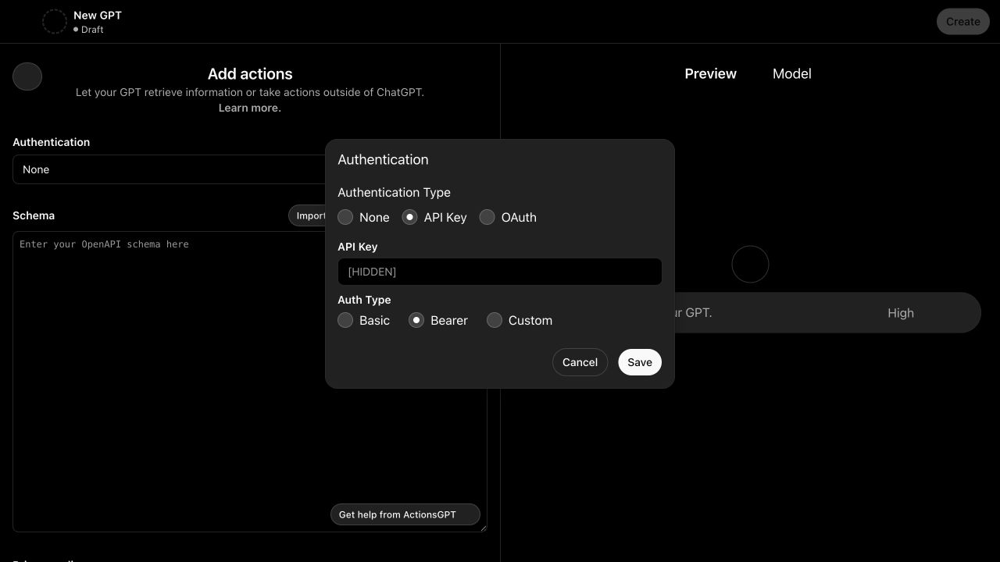

# Set up LocalTerminal Lite as a GPT Action

[中文](ACTIONS_SETUP.zh-CN.md) · [Recommended GPT instructions](GPT_INSTRUCTIONS.md) · [Short prompt playbook](PROMPT_PLAYBOOK.md) · [Privacy](PRIVACY.md)

This guide takes a new computer from installation to a tested private GPT. It uses LocalTerminal Lite 1.0.1 and the ChatGPT web editor. OpenAI currently limits GPT creation/editing to the web experience and eligible paid or managed-workspace users. A GPT can use **Apps or Actions, not both at the same time**. See OpenAI's [GPT creation guide](https://help.openai.com/en/articles/8554397-creating-a-gpt) and [Actions configuration guide](https://help.openai.com/en/articles/9442513).

> The ChatGPT screenshots are privacy-safe crops from local UI snapshots. They contain no conversation text, account identity, real endpoint, or real credential. ChatGPT's labels may move over time.

## The complete path



## 1. Install and start Lite

No Git, Node.js, or Bun installation is required beforehand.

### macOS

```bash
/bin/bash -c "$(curl -fsSL https://raw.githubusercontent.com/wyj-IIRtyj/localterminal-lite/v1.0.1/scripts/install-macos.sh)"
```

### Windows PowerShell

```powershell
powershell -NoProfile -ExecutionPolicy Bypass -Command "irm https://raw.githubusercontent.com/wyj-IIRtyj/localterminal-lite/v1.0.1/scripts/install-windows.ps1 | iex"
```

The installer downloads Bun when needed, downloads the tagged Lite source without Git, installs locked dependencies, registers `localterminal-lite` in the current user's PATH, and opens the TUI. Review the scripts before running them if your organization restricts remote scripts. For every later launch, open a new terminal and run only:

```text
localterminal-lite
```

On first launch, complete the TUI form:

1. choose `en` or `zh-CN` and a theme;
2. choose the project directory ChatGPT may access;
3. keep host `127.0.0.1` and port `3210` unless that port is occupied;
4. leave the public URL local for now;
5. accept or adjust output and command limits;
6. keep the generated Apps connector key and Actions token.

All later configuration is available from **6 Settings** with `c`. Do not edit a configuration file manually.


Visual check: the header says `running`; the Overview page shows exactly three exposed facade tools and masked connection credentials.



The Settings page is the single source of truth for the workspace, listening address, public URL, limits, and masked credentials.

## 2. Give Actions an HTTPS endpoint

ChatGPT cannot call `127.0.0.1`. For a quick private test, run a Cloudflare Quick Tunnel in a second terminal. Cloudflare documents Quick Tunnels as development/testing only; use a named tunnel and stable hostname for long-lived use.

### Install cloudflared on macOS without Homebrew

```bash
case "$(uname -m)" in
  arm64) CF_ARCH=arm64 ;;
  x86_64) CF_ARCH=amd64 ;;
  *) echo "Unsupported macOS architecture"; exit 1 ;;
esac
curl -fsSL "https://github.com/cloudflare/cloudflared/releases/latest/download/cloudflared-darwin-${CF_ARCH}.tgz" -o /tmp/cloudflared.tgz
tar -xzf /tmp/cloudflared.tgz -C /tmp
sudo install /tmp/cloudflared /usr/local/bin/cloudflared
cloudflared --version
```

If Homebrew is already installed, `brew install cloudflared` is the shorter official command.

### Install cloudflared on Windows PowerShell

```powershell
$CloudflaredDir = Join-Path $env:LOCALAPPDATA "cloudflared"
New-Item -ItemType Directory -Force -Path $CloudflaredDir | Out-Null
Invoke-WebRequest "https://github.com/cloudflare/cloudflared/releases/latest/download/cloudflared-windows-amd64.exe" -OutFile (Join-Path $CloudflaredDir "cloudflared.exe")
& (Join-Path $CloudflaredDir "cloudflared.exe") --version
```

Start the tunnel. Replace `3210` only if the TUI shows another port.

```bash
cloudflared tunnel --url http://127.0.0.1:3210
```

Windows, if the executable is not on `PATH`:

```powershell
& "$env:LOCALAPPDATA\cloudflared\cloudflared.exe" tunnel --url http://127.0.0.1:3210
```

Copy the generated `https://...trycloudflare.com` URL. In Lite, open **6 Settings**, press `c`, set **Public HTTPS URL** to that URL, and complete the form. Lite restarts safely with the new base URL. Cloudflare's official [Quick Tunnel guide](https://developers.cloudflare.com/cloudflare-one/networks/connectors/cloudflare-tunnel/do-more-with-tunnels/trycloudflare/) explains the random hostname and testing-only limitation.

> Keep both Lite and `cloudflared` running. A Quick Tunnel URL changes after restart; update the TUI public URL and re-import the Action schema when it changes.

## 3. Create and describe the GPT

Open [chatgpt.com/gpts/editor](https://chatgpt.com/gpts/editor) in a desktop browser. Choose the configuration view and enter a clear name and description.



1. **Name:** `LocalTerminal Lite Developer`
2. **Description:** `Works on one local project through auditable Lite sessions, collaboration messages, checkpoints, and extensions.`
3. **Instructions:** paste the complete block from [Recommended GPT instructions](GPT_INSTRUCTIONS.md).
4. **Conversation starters:** add two or three entries from the [short prompt playbook](PROMPT_PLAYBOOK.md).

## 4. Create the Action

Scroll to **Actions** and choose **Create new action**.



The Action surface intentionally has only three operations:

| Action operation | Meaning |
| --- | --- |
| `extensionDiscover` | Bootstrap identity or discover the authenticated concrete-tool catalog. |
| `extensionCall` | Run one concrete tool such as `session_register`, `read_file`, or `message_send`. |
| `extensionRegister` | Validate/upsert/remove a declarative custom extension; never create a session. |

## 5. Import the OpenAPI schema

Choose **Import from URL** and enter:

```text
https://YOUR-PUBLIC-HOST/openapi.json
```

For a Quick Tunnel this looks like:

```text
https://random-words.trycloudflare.com/openapi.json
```



The current document is OpenAPI `3.1.0`; `components.schemas` is a JSON object. The editor should show the three operation IDs above. Do not paste the Apps MCP URL here, and do not append the hidden Apps connector key.

## 6. Configure Bearer authentication

In the Action editor, open **Authentication**:

1. choose **API Key**;
2. paste the **Actions token** from Lite's Settings page;
3. choose **Bearer**;
4. save.



Press `v` in Lite Settings only when you intend to reveal credentials. The screenshot uses `[HIDDEN]`; never commit a real token.

Three values serve different purposes:

| Value | Where it goes | Purpose |
| --- | --- | --- |
| Actions token | GPT editor → Authentication → API Key/Bearer | Authenticates HTTP requests to the three facade endpoints. |
| `sessionId + sessionToken` | Top-level `identity` in authenticated Action calls | Identifies the current auditable Lite work session. |
| `claimCode` | `input` of one `session_inherit` call | One-time claim or handoff; it is not a reusable token. |

Never put a session token or claim code into the GPT editor's Authentication field.

## 7. Test in Preview

Keep the GPT private while testing. Send:

```text
Start a new root session for inspecting this project. Report the workspace summary, then checkpoint as waiting.
```

Expected sequence:

1. `extensionDiscover` without identity returns bootstrap guidance only.
2. `extensionCall` invokes `session_register` with `input.mode="root"`.
3. The GPT retains the returned `sessionId + sessionToken` internally.
4. Authenticated discovery exposes the concrete catalog.
5. `workspace_info` runs through `extensionCall` with top-level `identity`.
6. `session_checkpoint` records a summary and `waiting` phase before the answer ends.

Next, test collaboration:

```text
Delegate a read-only project-structure review and give me the handoff prompt for a second ChatGPT chat.
```

Paste the returned handoff prompt into a separate GPT conversation. The child must call `session_inherit` before work. Lite's Sessions page should show the continuation chain inside one logical card and delegated children as indented nodes.


## 8. Save and share deliberately

Create/save the GPT as **Only me** first. OpenAI may ask users to approve Actions before execution. If you later share by link or publish to the GPT Store, OpenAI requires a valid privacy-policy URL for a GPT with Actions. Adapt the [privacy template](PRIVACY.md) to the way you operate the GPT and host it at a stable public URL; the repository policy describes the unhosted Lite software, not every third-party deployment.

## Troubleshooting

| Symptom | Fix |
| --- | --- |
| `Input should be '3.1.1' or '3.1.0'` | Update Lite, import the exact `/openapi.json` URL, and remove any stale pasted schema. |
| `components.schemas ... is not an object` | You are using an older or altered schema. Lite 1.0.1 returns a concrete object. Re-import from the running service. |
| `spec must be an object` | `extensionRegister` needs top-level `spec:{...}`. Session creation belongs to `extensionCall` with `tool:"session_register"`. |
| `input.name is required`, `input.to is required`, or `input.body is required` | Put concrete arguments inside `extensionCall.input`, for example `{tool:"message_send", input:{to:"reviewer", body:"Ready"}, identity:{...}}`. |
| `IDENTITY_REQUIRED` | Create a root or inherit a handed-off session, then include the returned identity on every authenticated call. |
| `INVALID_IDENTITY` | If the same conversation became stale after interruption, call session_inherit with the previous sessionToken to reclaim the original session. For release/revoke/handoff, obtain a fresh claimCode from the TUI. Do not create a new root for the same unfinished task. |
| `CHECKPOINT_REQUIRED` | Call `session_checkpoint` before ordinary work continues. |
| `CHILD_REVIEW_REQUIRED` | Review the returned child summaries/messages/events and finish or cancel every child. |
| Schema URL cannot be reached | Verify Lite and the tunnel are both running, then open `https://YOUR-HOST/health` and `/openapi.json` in a browser. |
| HTTP 401 | Re-enter the Lite **Actions token** as API Key → Bearer. Do not use the Apps connector key. |

## Security boundary

The selected workspace is writable by the GPT through the facade. Use a dedicated project directory, review the Diff and Logs pages, keep credentials masked, and stop the tunnel when remote access is not needed. Quick Tunnels publish the local HTTP service to a public random hostname; the Actions Bearer token is therefore mandatory.
