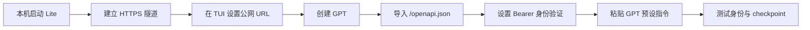
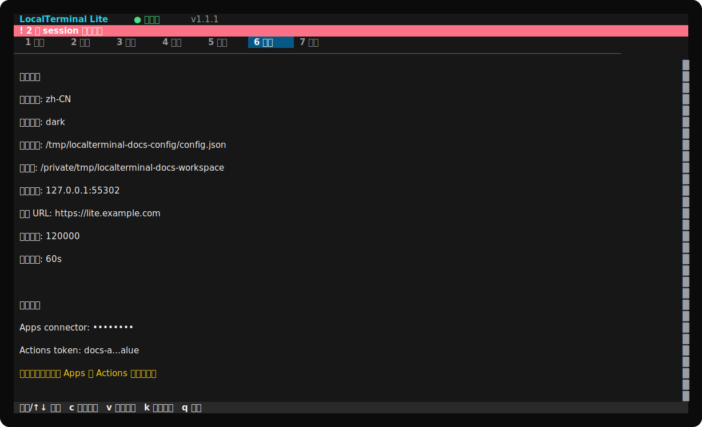
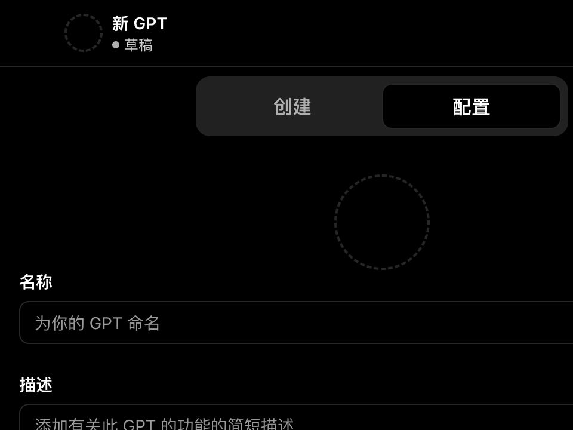
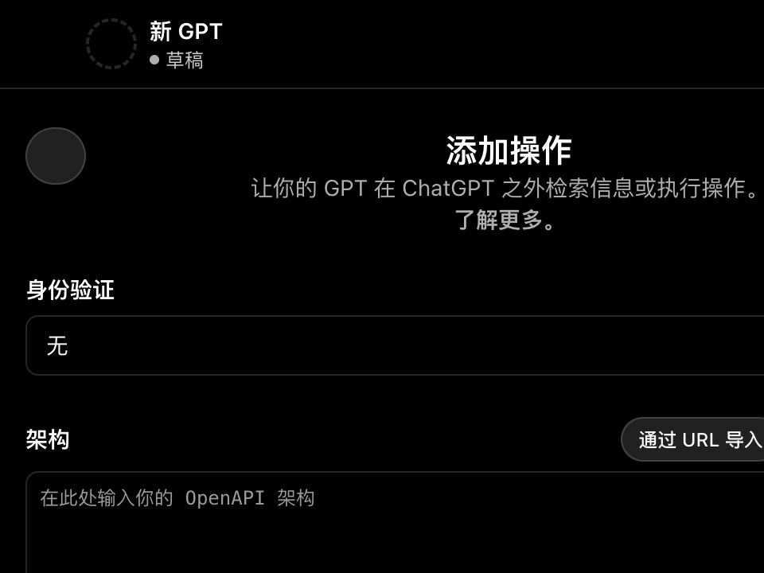
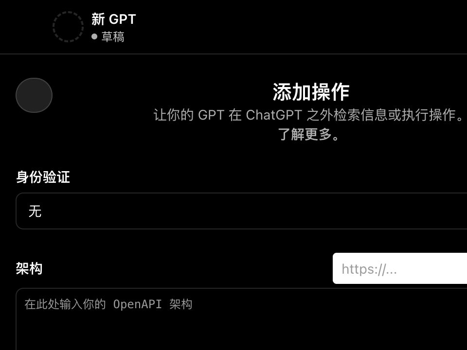
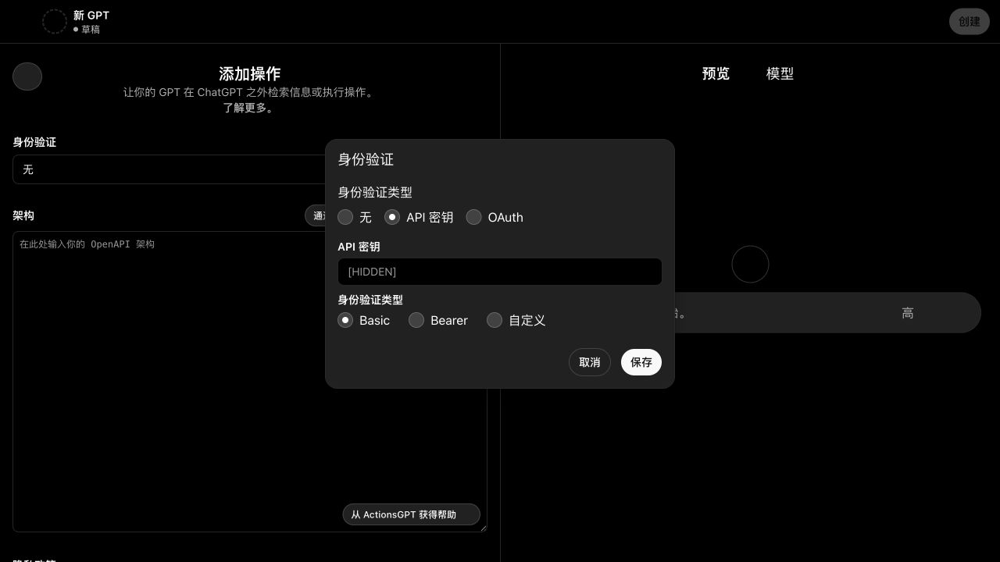

# 将 LocalTerminal Lite 配置为 GPT Action

[English](ACTIONS_SETUP.md) · [推荐 GPT 预设指令](GPT_INSTRUCTIONS.zh-CN.md) · [短提示词手册](PROMPT_PLAYBOOK.zh-CN.md) · [隐私说明](PRIVACY.zh-CN.md)

本教程从一台没有开发环境的新电脑开始，直到完成一个可测试的私有 GPT。教程基于 LocalTerminal Lite 1.0.0 和 ChatGPT 网页编辑器。OpenAI 当前只允许符合条件的付费用户或受管工作区用户在网页端创建/编辑 GPT；一个 GPT 只能选择 **Apps 或 Actions，不能同时使用两者**。参见 OpenAI 的 [GPT 创建说明](https://help.openai.com/en/articles/8554397-creating-a-gpt)和 [Actions 配置说明](https://help.openai.com/en/articles/9442513)。

> ChatGPT 截图来自本地 HTML 存档的隐私安全裁剪，只保留通用配置界面；不含聊天正文、账户身份、真实地址或真实凭据。ChatGPT 的具体标签以后可能调整。

## 完整路径



## 1. 安装并启动 Lite

无需提前安装 Git、Node.js 或 Bun。

### macOS

```bash
/bin/bash -c "$(curl -fsSL https://raw.githubusercontent.com/wyj-IIRtyj/localterminal-lite/v1.0.0/scripts/install-macos.sh)"
```

### Windows PowerShell

```powershell
powershell -NoProfile -ExecutionPolicy Bypass -Command "irm https://raw.githubusercontent.com/wyj-IIRtyj/localterminal-lite/v1.0.0/scripts/install-windows.ps1 | iex"
```

安装脚本会安装 Bun、在不依赖 Git 的情况下下载固定版本源码、安装锁定依赖并打开 TUI。如果组织不允许直接运行远端脚本，请先打开仓库中的脚本检查内容。

首次启动时在 TUI 中完成以下配置：

1. 选择 `zh-CN` 或 `en`，并选择主题；
2. 选择允许 ChatGPT 操作的项目目录；
3. 除非端口冲突，否则保持监听地址 `127.0.0.1`、端口 `3210`；
4. 公网 URL 暂时保持 local；
5. 接受或调整输出与命令限制；
6. 保留自动生成的 Apps connector key 和 Actions token。

以后所有配置都在 **6 设置** 页面按 `c` 修改，不要手动编辑配置文件。


视觉检查：顶部应显示“运行中”；概览页面只显示三个 facade 工具，并隐藏连接凭据。



设置页面是工作区、监听地址、公网 URL、限制和隐藏凭据的唯一配置入口。

## 2. 为 Actions 提供 HTTPS 地址

ChatGPT 无法访问 `127.0.0.1`。私有测试时，可以在第二个终端运行 Cloudflare Quick Tunnel。Cloudflare 明确说明 Quick Tunnel 只适合开发和测试；长期使用请改用 named tunnel 和固定域名。

### macOS 无 Homebrew 安装 cloudflared

```bash
case "$(uname -m)" in
  arm64) CF_ARCH=arm64 ;;
  x86_64) CF_ARCH=amd64 ;;
  *) echo "Unsupported macOS architecture"; exit 1 ;;
esac
curl -fsSL "https://github.com/cloudflare/cloudflared/releases/latest/download/cloudflared-darwin-${CF_ARCH}.tgz" -o /tmp/cloudflared.tgz
tar -xzf /tmp/cloudflared.tgz -C /tmp
sudo install /tmp/cloudflared /usr/local/bin/cloudflared
cloudflared --version
```

如果已经安装 Homebrew，官方的简短命令是 `brew install cloudflared`。

### Windows PowerShell 安装 cloudflared

```powershell
$CloudflaredDir = Join-Path $env:LOCALAPPDATA "cloudflared"
New-Item -ItemType Directory -Force -Path $CloudflaredDir | Out-Null
Invoke-WebRequest "https://github.com/cloudflare/cloudflared/releases/latest/download/cloudflared-windows-amd64.exe" -OutFile (Join-Path $CloudflaredDir "cloudflared.exe")
& (Join-Path $CloudflaredDir "cloudflared.exe") --version
```

启动隧道；只有 TUI 显示了其他端口时才替换 `3210`：

```bash
cloudflared tunnel --url http://127.0.0.1:3210
```

Windows 如果 executable 不在 `PATH`：

```powershell
& "$env:LOCALAPPDATA\cloudflared\cloudflared.exe" tunnel --url http://127.0.0.1:3210
```

复制输出的 `https://...trycloudflare.com` 地址。在 Lite 中进入 **6 设置**，按 `c`，把 **公网 HTTPS URL** 设置为该地址并完成表单。Lite 会安全重启并使用新的 base URL。Cloudflare [Quick Tunnel 官方说明](https://developers.cloudflare.com/cloudflare-one/networks/connectors/cloudflare-tunnel/do-more-with-tunnels/trycloudflare/)介绍了随机域名和测试限制。

> Lite 和 `cloudflared` 必须同时保持运行。Quick Tunnel 重启后 URL 会变化；变化后需要更新 TUI 公网 URL，并重新导入 Action schema。

## 3. 创建并描述 GPT

在桌面浏览器打开 [chatgpt.com/gpts/editor](https://chatgpt.com/gpts/editor)，进入配置视图，填写清楚的名称和描述。



1. **名称：** `LocalTerminal Lite Developer`
2. **描述：** `通过可审计 Lite session、协作消息、checkpoint 和扩展处理一个本地项目。`
3. **指令：** 粘贴[推荐 GPT 预设指令](GPT_INSTRUCTIONS.zh-CN.md)中的完整代码块。
4. **对话开场白：** 从[短提示词手册](PROMPT_PLAYBOOK.zh-CN.md)选择两到三条。

## 4. 创建 Action

滚动到 **操作（Actions）**，选择 **创建新操作**。



Actions 界面有意只暴露三个操作：

| Action 操作 | 语义 |
| --- | --- |
| `extensionDiscover` | 建立身份前返回引导；认证后发现具体工具目录。 |
| `extensionCall` | 调用 `session_register`、`read_file`、`message_send` 等具体工具。 |
| `extensionRegister` | 验证/upsert/remove 声明式扩展；绝不用于创建 session。 |

## 5. 导入 OpenAPI schema

选择 **从 URL 导入**，输入：

```text
https://你的公网域名/openapi.json
```

Quick Tunnel 示例：

```text
https://random-words.trycloudflare.com/openapi.json
```



当前文档是 OpenAPI `3.1.0`，`components.schemas` 是 JSON 对象。编辑器应显示上面的三个 operation ID。不要在这里填写 Apps MCP URL，也不要附加隐藏的 Apps connector key。

## 6. 配置 Bearer 身份验证

在 Action 编辑器中打开 **身份验证**：

1. 选择 **API 密钥**；
2. 粘贴 Lite 设置页显示的 **Actions token**；
3. 选择 **Bearer**；
4. 保存。



只有确实要查看凭据时才在 Lite 设置页按 `v`。截图使用 `[HIDDEN]`；绝不要提交真实 token。

三个值有完全不同的用途：

| 值 | 放置位置 | 用途 |
| --- | --- | --- |
| Actions token | GPT 编辑器 → 身份验证 → API 密钥/Bearer | 对三个 facade HTTP 端点进行传输层认证。 |
| `sessionId + sessionToken` | 认证 Action 调用顶层的 `identity` | 标识当前可审计 Lite 工作 session。 |
| `claimCode` | 一次 `session_inherit` 调用的 `input` | 一次性领取/交接；不是可重复使用的 token。 |

不要把 session token 或 claim code 填入 GPT 编辑器的身份验证字段。

## 7. 在预览中测试

测试阶段保持 GPT 私有。发送：

```text
为检查这个项目建立新的 root session。报告工作区概况，然后 checkpoint 为 waiting。
```

预期顺序：

1. 无身份的 `extensionDiscover` 只返回 bootstrap 引导；
2. `extensionCall` 用 `input.mode="root"` 调用 `session_register`；
3. GPT 在内部保存返回的 `sessionId + sessionToken`；
4. 认证后的 discover 暴露具体工具目录；
5. `workspace_info` 通过带顶层 `identity` 的 `extensionCall` 执行；
6. 回复结束前，`session_checkpoint` 写入 summary 和 `waiting` phase。

继续测试协作：

```text
委派一个只读的项目结构检查，并给我可粘贴到第二个 ChatGPT 对话的交接提示。
```

把交接提示粘贴到另一个 GPT 对话。子项开始工作前必须调用 `session_inherit`。Lite Sessions 页面应把 continuation 放在同一逻辑卡片内，并像目录一样缩进显示子 session。


## 8. 谨慎保存和分享

首次保存请选择 **仅自己**。OpenAI 可能会在 Action 执行前要求用户确认。如果以后通过链接分享或发布到 GPT Store，OpenAI 要求带 Actions 的 GPT 提供有效的隐私政策 URL。请根据你的实际运营方式修改[隐私模板](PRIVACY.zh-CN.md)，并放到稳定的公开 URL；仓库中的政策描述的是未托管的 Lite 软件，不能自动覆盖每一个第三方部署。

## 故障排查

| 现象 | 处理方法 |
| --- | --- |
| `Input should be '3.1.1' or '3.1.0'` | 更新 Lite，导入准确的 `/openapi.json` URL，并删除旧的手工 schema。 |
| `components.schemas ... is not an object` | 使用了旧版或被修改的 schema。Lite 1.0.0 返回具体对象；从运行中的服务重新导入。 |
| `spec must be an object` | `extensionRegister` 需要顶层 `spec:{...}`。创建 session 应使用 `extensionCall` + `tool:"session_register"`。 |
| `input.name is required`、`input.to is required` 或 `input.body is required` | 把参数放入 `extensionCall.input`，例如 `{tool:"message_send", input:{to:"reviewer", body:"Ready"}, identity:{...}}`。 |
| `IDENTITY_REQUIRED` | 创建 root 或领取交接 session，然后在每个认证调用中携带返回的 identity。 |
| `INVALID_IDENTITY` | token 已被撤销、释放、完成或变 stale。通过 TUI 撤销/签发新 claim，再 inherit。 |
| `CHECKPOINT_REQUIRED` | 先调用 `session_checkpoint`，再继续普通工作。 |
| `CHILD_REVIEW_REQUIRED` | 检查返回的子项总结、消息和事件；完成或取消全部子项。 |
| Schema URL 无法访问 | 确认 Lite 和隧道都在运行，然后在浏览器打开 `https://你的域名/health` 和 `/openapi.json`。 |
| HTTP 401 | 重新把 Lite **Actions token** 填为 API Key → Bearer；不要使用 Apps connector key。 |

## 安全边界

GPT 可以通过 facade 写入所选工作区。请使用专用项目目录，通过 Diff 和 Logs 页面审计变更，保持凭据隐藏，并在不需要远程访问时停止隧道。Quick Tunnel 会把本机 HTTP 服务放到公开的随机域名，因此 Actions Bearer token 必不可少。
